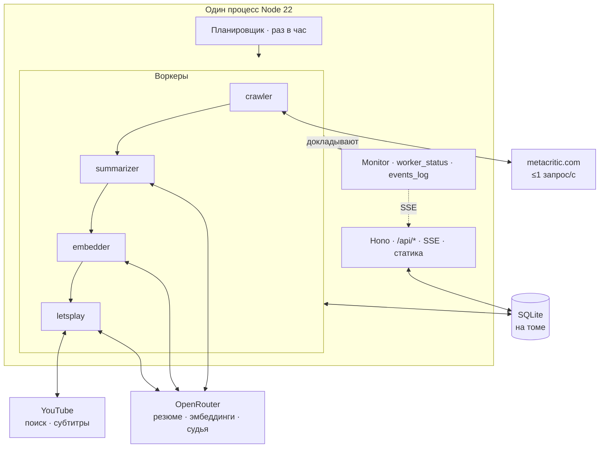
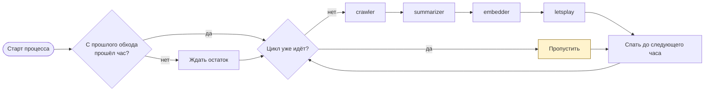
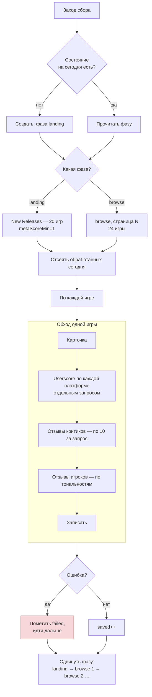
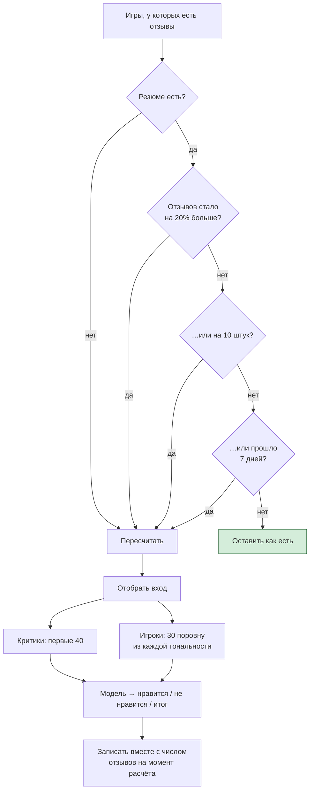
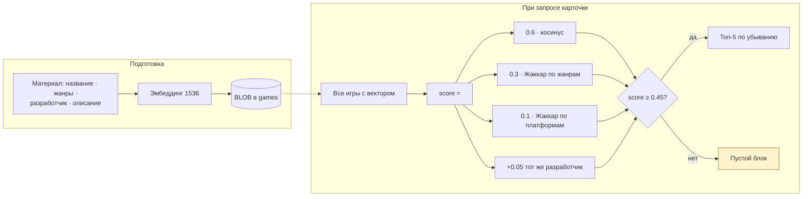
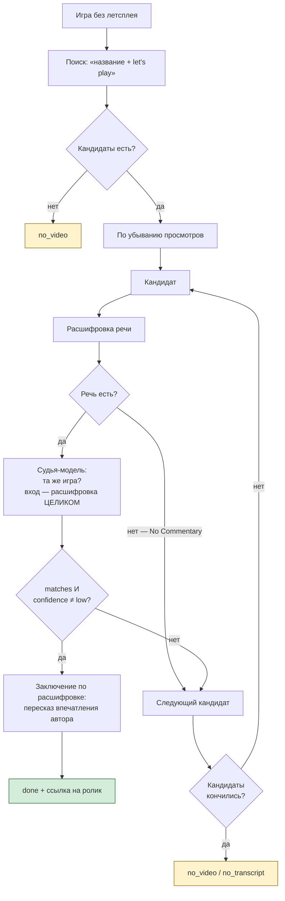
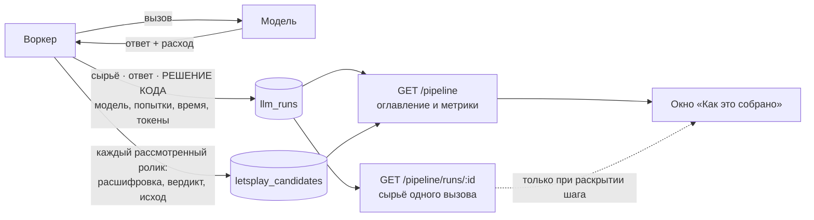
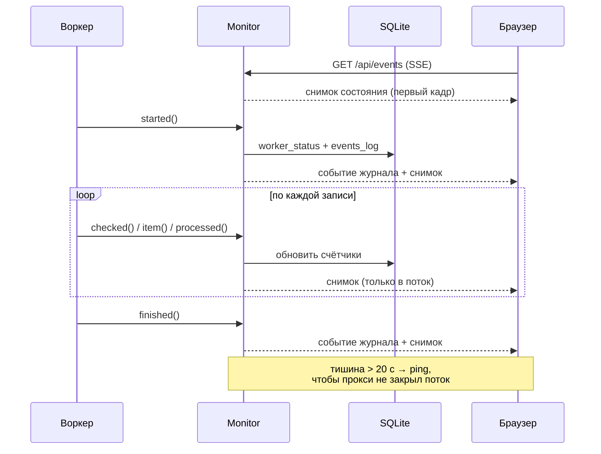
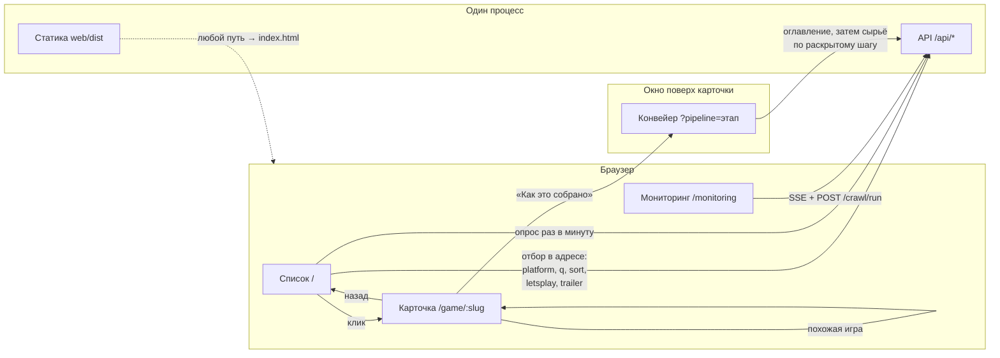

# mcwatch

Сервис-агрегатор новых игр с Metacritic. Раз в час забирает свежие релизы,
собирает карточки и отзывы, просит нейросеть написать резюме отзывов, подбирает
похожие игры и находит летсплей на YouTube с пересказом впечатления автора.

**Работающий сервис: https://mcwatch.docxi.org**

Тестовое задание для AI-инженера. Требования — [`docs/TASK.md`](docs/TASK.md).

Интерфейс — Vue 3, собирается в статику и отдаётся тем же процессом, что и
API. Служебный экран мониторинга —
[`/monitoring`](https://mcwatch.docxi.org/monitoring).

В карточке любой игры есть кнопка **«Как это собрано»**: она открывает изнанку
конвейера — что дословно уходило в модель на каждом шаге, что она вернула, во
что это обошлось и что с ответом сделал код.

---

## Быстрый старт

### Docker (локально, со своим HTTPS)

```bash
cp .env.example .env      # вписать OPENROUTER_API_KEY
docker compose up -d
```

Поднимаются два контейнера: приложение и Caddy с HTTPS. База лежит на
именованном томе и переживает перезапуск. Без переменной `DOMAIN` Caddy
поднимется на `localhost` с самоподписанным сертификатом.

На сервере используется `docker-compose.prod.yml` — без Caddy: там 80 и 443
занимает Nginx с другими сайтами, и контейнер слушает только петлю. Выкладка
идёт через GitHub Actions при push в `main`; виртуальный хост Nginx — в
[`deploy/nginx/`](deploy/nginx/).

### Локально

```bash
pnpm install
cp .env.example .env      # вписать OPENROUTER_API_KEY
pnpm db:migrate
pnpm dev                  # http://localhost:5173 (фронт), :3000 (API)
```

`pnpm dev` поднимает два процесса: бэкенд на 3000 и vite на 5173, который
проксирует `/api` на бэкенд. В продакшене процесс один — `pnpm build` кладёт
статику в `web/dist`, и сервер отдаёт её сам.

Нужен **Node 22+** и **pnpm**. Ключ OpenRouter — единственный секрет; без него
сбор данных работает, а резюме, эмбеддинги и летсплеи отключаются с
предупреждением.

---

## Как устроено

Один процесс: HTTP, планировщик и воркеры внутри. Очередь задач не нужна —
этапов три и они строго по порядку. Ни Redis, ни отдельных сервисов.



Подробный замысел и знание об источниках — [`docs/ARCHITECTURE.md`](docs/ARCHITECTURE.md).

---

## Процессы

### Часовой цикл

Этапы идут по порядку. **Сбой одного не отменяет следующие**: резюме нужны и по
играм, которые уже в базе, даже если обход сегодня не удался.



Первый цикл на старте запускается **не всегда**: если с прошлого обхода прошло
меньше часа, планировщик ждёт остаток. Иначе перезапуск контейнера в цикле
означал бы шквал запросов к источнику.

Принудительный запуск — `POST /api/crawl/run`; во время работы отвечает 409.

### Сбор игр

Ротация по ТЗ: первый заход дня — 20 игр из New Releases, дальше по одной
странице browse за заход. Смена календарной даты UTC сбрасывает состояние —
это происходит само, потому что состояние ключуется датой.



Игра считается обработанной сегодня **и при неудаче** — иначе следующий заход
упрётся в неё же вместо того, чтобы двигаться дальше.

### Отзывы и резюме

Резюме делается отдельно по критикам и по игрокам — одно на игру и вид, без
разбивки по платформам.



Выборка игроков берётся **по тональностям, а не первыми 30**: иначе резюме
перекосило бы в сторону хвалебных отзывов, которых всегда больше. Метки
тональности достоверны, потому что отзывы и собираются фильтром по тональности.

Возраст считается от даты расчёта резюме, а не от даты обхода: иначе частота
пересчёта зависела бы от того, как часто мы ходим.

**Нет отзывов — нет резюме.** Пустой блок честнее выдуманного текста.

### Похожие игры

Считает код, не модель: это арифметика по векторам, а не суждение.



Вектор пересчитывается, когда меняется материал: сборщик обнуляет его при
смене хеша, поэтому «нужен пересчёт» — это просто «его нет».

Жаккар двух пустых наборов даёт **0, а не 1**: «ничего не знаем об обеих» — не
признак сходства. Иначе игры без данных слипались бы друг с другом.

### Летсплеи

Самая тонкая часть: поиск YouTube возвращает что-нибудь **всегда**, и для
малоизвестных игр это чужой ролик.



**Тождество игры решает модель, а не код.** Два алгоритмических отсева подряд
пропускали чужие ролики: «The Hunter's Inn» → *The Red Dragon Inn* (совпали
слова «the» и «inn»), «Glow in the Shadows» → *Stella Glow*. Заключение по
такому транскрипту было бы рассказом о другой игре.

Коду остались только факты: сколько просмотров и есть ли вообще речь. Пустая
расшифровка — констатация, а не суждение, поэтому её отсеивает код.

Берётся **самый популярный из подходящих**, а не просто самый популярный.
Отвергнутые кандидаты записываются с причиной: потеря обязана быть видимой.

### Прозрачность конвейера



Каждый вызов модели записывается целиком: что ушло, что вернулось, во что
обошлось и **что с ответом сделал код**. Последнее хранится отдельно от ответа
намеренно — это разные вещи, и подменять одну другой значит искажать картину.

Кандидаты в летсплеи хранятся все, включая отбракованных, с расшифровкой и
причиной отказа. Раньше отказ жил строкой в журнале событий и исчезал при
ротации вместе с причиной.

Сырьё не едет вместе с оглавлением: у судьи это до 56 000 знаков на вызов.

Прозрачность окупилась в первый же день. Она показала, что
`providerOptions.dimensions` OpenRouter игнорирует — в базе лежали векторы на
2560 чисел там, где конфиг обещал 1536; что субтитры YouTube уходили в модель
с HTML-мнемониками (`it&#39;s` вместо `it's`); и что усечение, приехавшее без
пересчёта базы, разрезало её надвое — часть игр осталась без похожих молча, без
единой ошибки.

### Мониторинг



Обход длится минуты, и событий журнала за это время мало. Живость видна не по
журналу, а по **снимкам состояния**: они приходят на каждую обработанную запись
и меняют «чем занят» и счётчики. Снимки в журнал не пишутся — текущий элемент
интересен, только пока работа идёт.

**Счётчиков у воркера три, и это не педантизм.** «Проверено» — сколько единиц
рассмотрено, «обработано» — сколько дало результат, «ошибок» — сколько
сорвалось. Без первого честный простой неотличим от поломки: воркер резюме
может проверить тридцать три пары «игра + вид отзывов», правильно не найти
работы и показать ноль обработанных.

По той же причине у летсплеев на карточке стоит раскладка исходов: заключение
сделано · подходящего ролика нет · в роликах молчат · сорвалось · ещё не
искали. Счётчик считает только заключения, а работа была по всем.

---

## Интерфейс



Два экрана для посетителя и один служебный. Отбор списка целиком живёт в
адресной строке: ссылку можно переслать, а перезагрузка ничего не теряет.
Значения по умолчанию в адрес не пишутся, поэтому `/` и `/?sort=date` — одна
и та же страница.

Возврат из карточки восстанавливает и позицию прокрутки, и уже подгруженные
страницы: список хранит снимок и отдаёт его только тому же отбору.

**Список обновляется сам, без кнопки.** Опрос раз в минуту и обновление на
месте: карточки отрисованы по ключу `slug`, поэтому замена данных не
пересоздаёт узлы DOM — обложки не моргают, а вставку выше видимой области
компенсирует якорение прокрутки браузера. Появившиеся игры помечаются
акцентной рамкой на несколько секунд: обновление ничего не двигает, и без
пометки его было бы не заметить. В скрытой вкладке опрос молчит.

Три вещи, которые интерфейс обязан различать, и они проверены тестами:

| Различие | Почему важно |
|---|---|
| **Метаскор 0–100 и оценка игроков 0–10** | Разные шкалы. Пороги градации считаются от доли шкалы (0.75 и 0.5), поэтому формула одна, а 75 и 7.5 — одна зона. Суффикс шкалы стоит внутри плашки |
| **`null` и `0`** | `null` — не оценивали: пунктир и «нет оценки». `0` — настоящая оценка, красится в «плохо». Ноль вместо пропуска — самая частая ложь в каталогах |
| **«обложки нет» и «ссылка не открылась»** | Первое — свойство данных, второе — сбой загрузки. Заглушка одна, подпись разная |

Дыры в данных — норма, а не сбой: трейлера нет у 89% игр, ESRB у 70%, отзывов
у 55%, описания у 30%, обложки у 11%. Каждый такой случай объясняет себя
словами, а не исчезает молча.

---

## API

| Маршрут | Что делает |
|---|---|
| `GET /api/games` | Список: `platform`, `q`, `sort` (`metascore`/`userscore`/`date`/`title`), `letsplay=1`, `trailer=1`, `page`, `pageSize` |
| `GET /api/games/:slug` | Карточка: все поля, оценки по платформам, оба резюме, похожие, летсплей |
| `GET /api/platforms` | Справочник платформ со счётчиком игр |
| `GET /api/facets` | Сколько игр с летсплеем и с трейлером — числа для чипов |
| `GET /api/games/:slug/pipeline` | Как получилась карточка: этапы, метрики вызовов, кандидаты |
| `GET /api/games/:slug/pipeline/runs/:id` | Сырьё и ответ одного вызова модели |
| `GET /api/status` | Состояние воркеров, счётчики, состояние обхода, последние события |
| `GET /api/events` | Поток SSE: снимки состояния и события журнала |
| `POST /api/crawl/run` | Принудительный запуск. 202 · 409 если идёт · 503 если планировщик выключен |
| `GET /api/health` | Проверка живости; работает и без базы |

Полный контракт — [`docs/ARCHITECTURE.md` §5](docs/ARCHITECTURE.md); формы
ответов объявлены в `src/api/types.ts`, и фронт берёт их оттуда типовым
импортом. Брифы [`docs/UI-BRIEF.md`](docs/UI-BRIEF.md) и
[`docs/UI-BRIEF-MONITORING.md`](docs/UI-BRIEF-MONITORING.md) — исторические
документы, отправленные дизайнеру: они описывают контракт на момент 07.09.2026
и с тех пор отстали.

---

## Команды

```
pnpm dev                 сервер в режиме разработки
pnpm build               сборка
pnpm check               typecheck + lint + тесты   ← гейт
pnpm test:live           сетевые тесты, вручную

pnpm crawl --once        один заход сбора
pnpm summarize --once    один прогон резюме
pnpm embed --once        эмбеддинги; --show N печатает похожие
pnpm letsplay --once     подбор летсплеев
pnpm rebuild --yes       пересчитать всё производное заново
pnpm db:migrate          миграции
```

`rebuild` чистит резюме, векторы, летсплеи и журнал вызовов модели и считает
их заново. Игры и отзывы не трогает: они собраны с Metacritic, и тянуть их
повторно значило бы зря беспокоить источник. Это платные вызовы.

Каждый воркер можно запустить отдельно — удобно и для отладки, и для разбора
того, что именно сломалось.

---

## Как использовался ИИ

Обязательный раздел: что делает модель в рантайме, что нет, и почему.

### Что делает модель

| Задача | Модель | Вход |
|---|---|---|
| Резюме отзывов | `z-ai/glm-4.7-flash` | До 40 отзывов критиков либо 30 игроков |
| Эмбеддинги для похожих | `qwen/qwen3-embedding-4b`, 1536 | Название · жанры · разработчик · описание |
| Судья «тот ли это ролик» | `z-ai/glm-4.7-flash` | Карточка игры + расшифровка **целиком** |
| Заключение по летсплею | `z-ai/glm-4.7-flash` | Расшифровка **целиком** |

Всё — через один ключ OpenRouter и Vercel AI SDK, структурированный вывод по
zod-схеме. Модели — константы в [`src/config/models.ts`](src/config/models.ts),
не в коде вызовов.

**И это не декларация, а проверяемый факт.** В карточке любой игры есть кнопка
«Как это собрано»: она открывает окно, где по каждому шагу видно, что дословно
ушло в модель, что она вернула, сколько это заняло токенов, времени и денег —
и что с ответом сделал код. Последнее не то же самое, что предпоследнее: судья
может ответить «совпадает, уверенность низкая», а код всё равно перейдёт к
следующему ролику.

Модели выбраны не по прайсу, а сравнением на настоящих отзывах. DeepSeek
V4-Flash ломал структурированный вывод на длинном входе, Mistral Nemo отвечал
по-английски вопреки требованию, GPT-OSS не даёт отключить рассуждения. Разбор
с цифрами — `docs/ARCHITECTURE.md` §7.

### Чего модель не делает

Сбор, разбор ответов Metacritic, ротация страниц, дедупликация, подбор похожих
игр, выбор кандидатов в летсплеи, все счётчики и статусы — **детерминированный
код**. Модель не решает, какую страницу обходить и какую игру считать похожей.

### Где граница проходит не там, где кажется

Изначально проверку «тот ли это ролик» делал код. Два правила подряд —
совпадение по доле слов и вхождение названия фразой — пропускали чужие ролики,
потому что тождество игры это семантика, а не строковое сравнение. Проверку
отдали модели; коду остались факты: просмотры и наличие речи.

Обратный случай: пустая расшифровка отсеивается **кодом**, потому что это
констатация, а не суждение.

### Правила, которые соблюдаются везде

- **Нет данных — `null`,** не 0 и не выдуманный текст. Нет отзывов — нет
  резюме, а не «отзывы в целом положительные».
- **Модель опирается только на данные.** В подсказках прямо запрещено
  добавлять знания об игре со стороны: резюме пересказывает отзывы,
  заключение — речь автора ролика.
- **Сомнение — не приговор.** `confidence: low` у судьи означает «не знаю»:
  кандидат пропускается, берётся следующий, причина записывается.
- **Отброшенное видно.** Отвергнутые кандидаты и пропущенные элементы
  списка попадают в журнал с причиной.

---

## Ограничения и особенности

Проверено на живых данных, а не предположено.

**Поток browse — это шлак.** Замер по базе из 44 собранных игр:

| Чего нет | Доля игр |
|---|---|
| Трейлера | 89% |
| Возрастного рейтинга ESRB | 70% |
| Отзывов, а значит и резюме | 55% |
| Описания | 32% |
| Обложки | 5% |

Это норма источника, а не сбой сервиса. Интерфейс обязан выглядеть достойно в
каждом из этих случаев, и в брифе на интерфейс эти доли указаны отдельно.

**Летсплей находится не всем.** Из 19 игр, которые прошёл воркер, заключение
получили 12 — около двух третей. Остальным честно ставится `no_video`: для
малоизвестных игр летсплеев просто не существует, а судья отвергает ролики про
другие игры.

**Субтитры YouTube с датацентровых адресов.** Прямой запрос `timedtext` с
нашего IP возвращает 200 и ноль байт — это блокировка. Рабочий путь найден
(`youtube-transcript-plus`), но YouTube иногда отвечает отказом, замаскированным
под «негодный идентификатор»: те же ролики через минуту работают. Поэтому
повторы обязательны и такая ошибка не считается окончательной.

**Whisper не реализован.** Он закрыл бы только те игры, где у роликов нет
субтитров вовсе, ценой бинарника `yt-dlp` на 18 МБ и `ffmpeg` в образе. Решение
владельца — отложить; осознанный пробел, а не упущение.

**Поиск по названию регистронезависим только для латиницы** — SQLite без ICU.
Названия у Metacritic латинские, этого достаточно.

**Обложки отдаются в оригинальном размере**, часто по 300–500 КБ, с чужого
домена. Уменьшить их на сервере нельзя.

**Стоимость вызовов — оценка, а не факт.** Считается по прайсу из конфига:
OpenRouter отдаёт фактическую цену отдельным запросом, и дёргать его ради
копеек на каждый вызов незачем. Прайс — числа на 07.09.2026, они устареют
молча.

**Записи о вызовах модели начинаются с 08.09.2026.** У игр, собранных раньше,
окно конвейера честно говорит, что этап пройден до появления записи, — резюме
и заключения на карточке настоящие, но восстановить, что именно уходило в
модель, уже нельзя. Выдумывать это мы не станем; для боевой базы есть
`pnpm rebuild --yes`.

---

## Проверка

```bash
pnpm check       # 199 тестов: typecheck + lint + vitest
pnpm test:live   # сетевые тесты, вручную — не входят в гейт
```

Парсеры проверяются на сохранённых фикстурах в
[`test/fixtures/metacritic/`](test/fixtures/metacritic/), а не на сети: у каждой
записан точный URL и дата съёмки. Сетевые тесты вынесены отдельно и нужны, чтобы
заметить, что формы источника поехали.

Внешние вызовы — только через клиентов в `src/clients/`, с таймаутом, повторами
и ограничением частоты. К Metacritic — не чаще одного запроса в секунду, с
User-Agent, называющим проект и контакт.

---

## Структура

```
src/
  clients/      Metacritic, OpenRouter, YouTube — единственные двери наружу
  workers/      crawler, summarizer, embedder, letsplay, scheduler, monitor
  db/           схема Drizzle, миграции, репозитории
  api/          маршруты и формы ответов
  config/       окружение, модели, логи
web/            интерфейс на Vue 3 + Vite; сборка ложится в web/dist
  src/views/      список, карточка, мониторинг, 404
  src/components/ плашка оценки, обложка, резюме, таблица платформ, летсплей,
                  окно конвейера, подсветка JSON
  src/lib/        шкалы оценок, отбор в адресе, подписи, поток SSE,
                  слежение за каталогом, чтение сырья
test/           тесты и фикстуры
docs/           ТЗ, архитектура, брифы на интерфейс
ui/             макеты и спека интерфейса из Claude Design
```

## Документы

| Файл | Что |
|---|---|
| [`docs/TASK.md`](docs/TASK.md) | ТЗ заказчика |
| [`docs/ARCHITECTURE.md`](docs/ARCHITECTURE.md) | Замысел, схема данных, знание об источниках |
| [`docs/UI-BRIEF.md`](docs/UI-BRIEF.md) | Бриф на интерфейс каталога |
| [`docs/UI-BRIEF-MONITORING.md`](docs/UI-BRIEF-MONITORING.md) | Бриф на экран мониторинга |
| [`docs/UI-BRIEF-PIPELINE.md`](docs/UI-BRIEF-PIPELINE.md) | Бриф на окно конвейера |
| [`RULES.md`](RULES.md) | Цикл работы над шагом |
| [`TODO.md`](TODO.md) · [`READY.md`](READY.md) · [`COMPROMISES.md`](COMPROMISES.md) | Открытое, закрытое, компромиссы |
