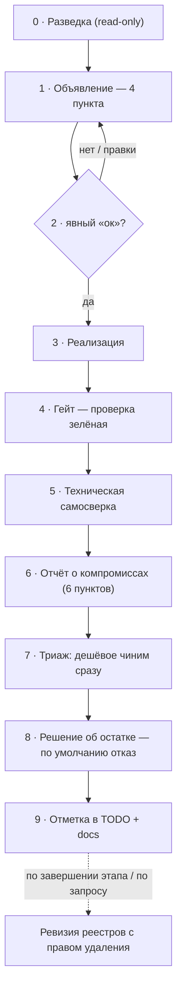

# Цикл работы над шагом

Три стороны защиты от дрейфа: **дисциплина на входе** в шаг, **честность на
выходе**, **память между** шагами. Формулировки общие, вне реалий конкретного
проекта.

Артефакты памяти: `TODO.md` (открытая работа — **не более 12 действий** плюс
короткий раздел «ждут решения владельца»), `COMPROMISES.md` (сквозные
недостатки, способные помешать **до ближайшего гейта**), `READY.md` (реестр
закрытого: туда переезжают закрытые пункты обоих файлов с датой и сводкой).

## Цикл

## До кода

**0. Разведка** — read-only, без «ок». Прежде чем объявлять, открой и прочитай
связанные файлы, источники, установленные факты; проверь окружение и
зависимости. Объявление собирается из прочитанного, не из догадок. Не
предполагай содержимое — читай.

**1. Объявление — четыре пункта.** До первого изменения файлов проговори в чате:
1. **Что** будет сделано — наблюдаемое изменение одной-двумя фразами, без
   деталей реализации.
2. **На основании чего и к какому гейту** — конкретный источник (пункт плана,
   требование, решение в чате, документ) **и** ближайший гейт, к которому шаг
   приближает. Не привязывается к источнику → остановись и подними вопрос, а не
   достраивай интерпретацию. Не приближает ни к какому гейту → это не шаг, а
   находка: ей место в разделе «Что не является пунктом плана» (п. 8).
3. **Как проверю** — тест/проверка, подтверждающая шаг; формулируется до кода.
4. **Границы** — что в этом шаге НЕ делается. Если параллельно работает
   другой исполнитель, границы до реализации фиксируются и в разделяемом
   файле состояния (механика — в контексте проекта).

Если в шаге есть развилка — оцени, твоё это решение или владельца. Решение
владельца выноси в объявлении с рекомендацией и жди ответа.

**2. Ждать «ок».** Только после явного «ок» — к коду. Общая фраза не «ок».
(Предварительное «ок» владелец даёт осознанно — трактуй как разрешение
приступить сразу после объявления.)

## Во время

**3. Реализация.** Сначала пойми, потом пиши — следуй существующим паттернам.
Не упрощай молча: если упрощаешь — объяви, что теряется. Каждый выбор осознан,
с основанием. Быстро ≠ хорошо: один выверенный проход дешевле трёх доработок.

## После кода

**4. Гейт.** Прогони проверочный набор проекта (тесты, типизация, линт и любая
сборка / smoke / e2e, которых требует изменение). Гейт зелёный до отчёта;
заявленная в п.3 проверка — среди прогнанного.

**5. Техническая самосверка.** Сделал ли ровно заявленное; нет ли побочных
правок в незатронутых файлах; проходят ли ранее зелёные тесты; привязывается ли
код к заявленному источнику.

**6. Отчёт о компромиссах — шесть пунктов.** По каждому явный ответ (описание
либо «нет» / «не применимо»); молчание по пункту не допускается.
1. **Пропущено** — части шага, проверки, случаи, которые не сделаны.
2. **Упрощено** — где реализация беднее замысла.
3. **Срезаны углы** — заглушка / mock / копипаста / поверхностное решение вместо
   разбора корня.
4. **Костыли** — работает, но архитектурно неверно (обход типизации, подавление
   ошибок, нарушение слоёв, дублирование).
5. **Необоснованный хардкод** — магические числа / строки / пути там, где нужен
   параметр или конфиг.
6. **TODO и заглушки** — «потом доделать», временные значения, pending-тесты.

Правило: при сомнении — упоминать, не скрывать. Отчёт — сырая фиксация фактов,
не самооправдание. **Отчёт остаётся полным: назвать нужно всё.** Сокращается не
он, а число записей, которые он порождает (п. 8).

**7. Триаж и устранение.** Сразу после отчёта пройди по ненулевым пунктам и
раздели: что закрываемо **сейчас минимальным усилием, без зависимости от будущих
шагов** — устрани немедленно (устранение проходит те же самосверку и отчёт);
остальное — в п. 8. Не жди отдельной просьбы.

**8. Решение об остатке — четыре исхода, по умолчанию отказ.** Каждый
неустранённый недостаток получает ровно один исход, и исход называется вслух:

1. **Отказ** — «замечено, признано не стоящим записи». Строка в отчёте шага,
   дальше никуда не переносится. **Это исход по умолчанию.**
2. **Комментарий в коде** — локальная деталь у самого места (тип-дыра на
   границе, осознанное допущение). Живёт там, где понадобится, и места в
   реестрах не занимает.
3. **`TODO.md`** — только если недостаток проходит проверку ниже и привязан к
   конкретному пункту плана.
4. **`COMPROMISES.md`** — только если недостаток проходит проверку ниже, но
   естественного дома в плане не имеет.

**Проверка на право быть записанным — один вопрос: помешает ли это пройти
ближайший гейт?** Гейт формулируется наблюдаемо (числом, работающим сценарием,
предъявляемым результатом) и известен до шага (п. 1.2).

- «Да, мешает» → исход 3 или 4.
- «Нет» → исход 1.
- «Не знаю» → **тоже исход 1**. Недостаток, важность которого не удаётся
  обосновать сегодня, всплывёт сам, когда начнёт мешать, — и всплывёт в
  актуальной редакции, а не в редакции месячной давности.

**Отказ — не сокрытие.** Отчёт (п. 6) называет всё; отказ — это решение о судьбе
названного, принятое вслух. Разница между «я об этом промолчал» и «я об этом
сказал и решил не заводить пункт» — принципиальная.

**Потолок плана.** `TODO.md` — не более 12 действий: столько видно одним
взглядом, и ровно поэтому список читается, а не пролистывается. Реестр полон →
новый пункт заводится **только вместо другого**, и вытеснение называется вслух:
«завожу X, снимаю Y, потому что Y дальше от гейта». Потолок — не эстетика: пока
дописать строку бесплатно, сравнение важности не происходит никогда.

**Что не является пунктом плана** (частая ошибка — записывать это в реестры,
где оно бессмертно, потому что закрыть его нечем):

- **Знание** («такой-то источник закрыт, у таких марок документов не бывает,
  библиотека ведёт себя так-то») — в предметный документ: проектную
  документацию или методичку той работы, к которой относится. Знание не
  закрывается кнопкой.
- **Решение владельца** — в отдельный короткий раздел `TODO.md`, не вперемешку
  со своей работой: закрыть его исполнитель не может, и в общем списке оно
  выглядит невыполненной работой.
- **Замысел** — в проектных документах. План не носитель замысла; описанное в
  документах дублировать в него не нужно.

**9. Отметка выполненного.** Отметь пункт закрытым + «Сделано» / «Остаток» и
перенеси его из `TODO.md` в `READY.md` (закрытый компромисс — из
`COMPROMISES.md` туда же). Смену дизайна отрази в проектных документах; решение
с отвергнутыми альтернативами — в документе обоснований.

## Между шагами

**Ревизия реестров — с правом удаления.** По завершении этапа или по запросу
владельца пройди `TODO.md` и `COMPROMISES.md`: что закрываемо сейчас — закрой,
не дожидаясь отдельной задачи; что устарело — пометь закрытым с пояснением; что
блокировано — оставь, при нужде обнови описание; **запись, чью важность нельзя
обосновать ближайшим гейтом сегодня, — удали.**

Удаление здесь штатный исход, а не потеря: замысел живёт в проектных
документах, сделанное — в `READY.md`, а действительно нужное вернётся само.
Реестр из шестидесяти записей, который никто не читает, — не страховка, а её
иллюзия.

## Зачем

Без проговаривания шага агент в длинной цепочке копит мелкие «разумные»
интерпретации, вместе уводящие от замысла. Без честного отчёта копится невидимый
технический долг. Без durable-фиксации отчёт растворяется в чате и памяти.

Но фиксация без отбора превращается в свою противоположность: реестр, который
перестают читать, защищает ровно от того же, от чего защищает пустой файл, —
и при этом создаёт ощущение, что работа под контролем. Поэтому у записи есть
цена, порог и потолок. Это не бюрократия и не расслабление, а три вещи:
дисциплина на входе, честность на выходе и **читаемая** память между шагами.
